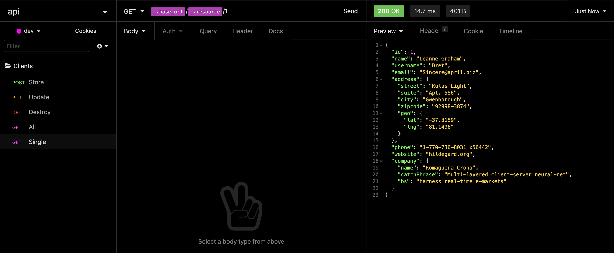

 <div align="center" id="top"> </div>

<h1 align="center"> API </h1>

<p align="center">
  <a href="#dart-sobre"> Sobre </a> &#xa0; | &#xa0; 
  <a href="#muscle-o-que-aprendi"> O que aprendi </a> &#xa0; | &#xa0;
  <a href="#rocket-tecnologias"> Tecnologias </a> &#xa0; | &#xa0;
  <a href="#white_check_mark-requisitos"> Requisitos </a> &#xa0; | &#xa0;
  <a href="#checkered_flag-iniciando"> Iniciando </a> &#xa0; | &#xa0;
  <a href="#bulb-dica"> Dica </a> &#xa0; | &#xa0;
  <a href="#books-onde-aprender-mais"> Onde aprender mais </a> &#xa0; | &#xa0;
  <a href="#facepunch-créditos"> Créditos </a> &#xa0; | &#xa0;
  <a href="https://www.linkedin.com/in/luiza-lissandra/" target="_blank"> Desenvolvedora </a>
</p>

<br>

## :dart: Sobre ##

Este projeto foi feito para aprender e praticar API, REST e RESTful.

## :muscle: O que aprendi ##

API (Application Programming Interface - Interface de Programação de Aplicações) é um conjunto de rotinas e padrões definidos por uma aplicação e disponível para outras aplicações.

**Quais são os benefícios de se utilizar uma API?**

1. Dá para desenvolver múltiplos front-ends e utilizar um mesmo back-end. Por exemplo, um site e uma aplicação mobile podem acessar simultaneamente o mesmo back-end;
2. Possibilita o uso de um protocolo de comunicação padronizado, pois permite que tanto aplicações web como mobile se comuniquem com a mesma estrutura.

Mas, você pode estar se perguntando, de que forma é possível que um site e um aplicativo tenham acesso ao mesmo conteúdo e do mesmo modo? A resposta é simples: através do uso de arquivos JSON.

- **JSON**

Arquivos do tipo JSON (JavaScript Object Notation - Notação de Objetos JavaScript) possuem uma formatação leve de troca de dados que é facilmente lida por humanos e entendida por máquinas.

Veja o exemplo abaixo:

```json
{

	"nome": "Luiza",

	"idade": 20,

	"interesses": ["programação", "design"]

}
```

Para saber mais sobre JSON:

 :bulb:[Introdução ao JSON](https://www.json.org/json-pt.html)

Mas o que seria o "REST" do API REST?

- **REST**

REST (Representational State Transfer - Transferência de Estado Representacional) é um conjunto de princípios de arquitetura que permitem a criação de um projeto com interfaces bem definidas.

**Características do REST:**

—>  Está muito ligado a dar semântica às requisições realizadas a um servidor. Com REST, a transferência de dados é feita de maneira mais intuitiva;

—> A transferência de dados é, geralmente feita com o uso do protocolo HTTP;

—> Ele delimita algumas obrigações relacionadas a transferências de dados.

**Padrões REST**

—> [Client-server] O cliente e o servidor (armazenamento de dados) precisam estar separados;

—> [Stateless] Cada requisição feita deve conter todas as informações necessárias para que o servidor entenda e possa respondê-la. O servidor não pode armazenar um estado;

—> [Cacheable] As respostas de uma requisição devem ser explícitas ao dizer se a requisição pode ou não ser cacheada (armazenada) pelo cliente;

—> [Layered System] O cliente acessa um endpoint sem precisar saber da complexidade, de quais passos estão sendo necessários para o servidor responder a requisição ou quais outras camadas o servidor está lidando para que a requisição seja respondida;

—> [Uniform Interface] É ser uniforme na nossa interface, por exemplo, ao usar corretamente os verbos HTTP (get, post, put, delete etc.) ou optar pelo padrão de usar JSON e não usar outros tipos, como XML ou outros formatos;

—> [Code on demand (optional)] Permite a aplicação pegar códigos, como javascript, e executar no cliente.

- **RESTful**

É a capacidade de determinado sistema aplicar os padrões de REST.

## :rocket: Tecnologias ##

As seguintes tecnologias foram utilizadas nesse projeto:

- [Node.js](https://nodejs.org/en/)
- [Express](https://expressjs.com/pt-br/)

## :white_check_mark: Requisitos ##

Antes de começar :checkered_flag:, você precisa ter o [Git](https://git-scm.com) e o [Node](https://nodejs.org/en/) instalados.

## :checkered_flag: Iniciando ##

```bash
# Clone este projeto.
$ git clone https://github.com/LissandraRodrigues/API

# O acesse.
$ cd api

# Instale as dependências.
$ yarn install

# Execute o projeto.
$ yarn start

# O servidor irá inicializar em <http://localhost:3000>
```

## :bulb: Dica ##

Utilize o <a href='https://insomnia.rest/'>Insomnia</a>, pois ele é um cliente HTTP que permite fazermos requisições para API sem precisar utilizar um browser.




## :books: Onde aprender mais ##

- <a href='https://www.youtube.com/watch?v=ghTrp1x_1As'> O que é API? REST e RESTful? (Youtube - Rocketseat); </a>
- <a href='https://becode.com.br/o-que-e-api-rest-e-restful/'> O que é API? REST e RESTful? Conheça as definições e diferenças </a>


## :facepunch: Créditos ##

Os dados usados na aplicação com o arquivo JSON foram retirados <a href='https://jsonplaceholder.typicode.com/users'> desse site. </a>

<hr/>

Feito por <a href="https://www.linkedin.com/in/luiza-lissandra/" target="_blank"> Luiza Lissandra :rocket: </a>

&#xa0;

<a href="#top"> Voltar para o início </a>
